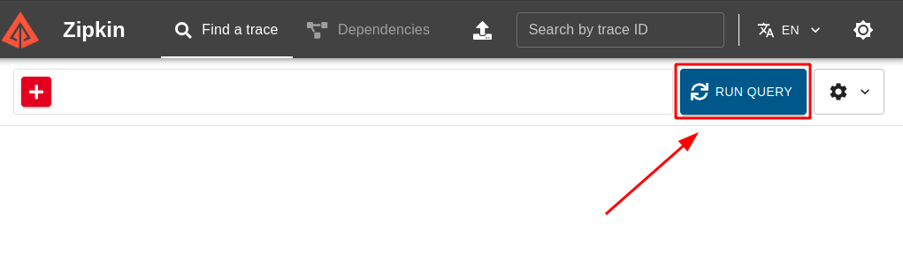

# Labs - Desafio 2 - Tracing distribuído e Span (Pós Graduação GoExpert)

### DESCRIÇÃO DO DESAFIO

**Objetivo:** Desenvolver um sistema em Go que receba um CEP, identifica a cidade e retorna o clima atual (temperatura em graus celsius, fahrenheit e kelvin) juntamente com a cidade. Esse sistema deverá implementar OTEL(Open Telemetry) e Zipkin.

Baseado no cenário conhecido "Sistema de temperatura por CEP" denominado Serviço B, será incluso um novo projeto, denominado Serviço A.

**Requisitos - Serviço A (responsável pelo input):**

- O sistema deve receber um input de 8 dígitos via POST, através do schema:  { "cep": "29902555" }
- O sistema deve validar se o input é valido (contem 8 dígitos) e é uma STRING
  - Caso seja válido, será encaminhado para o **Serviço B** via HTTP
  - Caso não seja válido, deve retornar:
    - Código HTTP: **422**
    - Mensagem: **invalid zipcode**

**Requisitos - Serviço B (responsável pela orquestração):**

- O sistema deve receber um CEP válido de 8 digitos
- O sistema deve realizar a pesquisa do CEP e encontrar o nome da localização, a partir disso, deverá retornar as temperaturas e formata-lás em: Celsius, Fahrenheit, Kelvin juntamente com o nome da localização.
- O sistema deve responder adequadamente nos seguintes cenários:
  - Em caso de sucesso:
  - Código HTTP: **200**
- Response Body: { "city: "São Paulo", "temp_C": 28.5, "temp_F": 28.5, "temp_K": 28.5 }
- Em caso de falha, caso o CEP não seja válido (com formato correto):
  - Código HTTP: **422**
  - Mensagem: **invalid zipcode**
- ​​​Em caso de falha, caso o CEP não seja encontrado:
  - Código HTTP: **404**
  - Mensagem: **can not find zipcode**

Após a implementação dos serviços, adicione a implementação do OTEL + Zipkin:

  - Implementar tracing distribuído entre Serviço A - Serviço B
  - Utilizar span para medir o tempo de resposta do serviço de busca de CEP e busca de temperatura

**Dicas:**

- Utilize a API viaCEP (ou similar) para encontrar a localização que deseja consultar a temperatura: https://viacep.com.br/
- Utilize a API WeatherAPI (ou similar) para consultar as temperaturas desejadas: https://www.weatherapi.com/
- Para realizar a conversão de Celsius para Fahrenheit, utilize a seguinte fórmula: F = C * 1,8 + 32
- Para realizar a conversão de Celsius para Kelvin, utilize a seguinte fórmula: K = C + 273
  - Sendo F = Fahrenheit
  - Sendo C = Celsius
  - Sendo K = Kelvin
- Para dúvidas da implementação do OTEL, você pode [clicar aqui](https://opentelemetry.io/docs/languages/go/getting-started/)
- Para implementação de spans, você pode [clicar aqui](https://opentelemetry.io/docs/languages/go/instrumentation/#creating-spans)
- Você precisará utilizar um serviço de [collector do OTEL](https://opentelemetry.io/docs/collector/quick-start/)
- Para mais informações sobre Zipkin, você pode clicar [aqui](https://zipkin.io/)

**Entrega:**

- O código-fonte completo da implementação.
- Documentação explicando como rodar o projeto em ambiente dev.
- Utilize docker/docker-compose para que possamos realizar os testes de sua aplicação.


### PRÉ-REQUISITOS

#### 1. Instalar o GO no sistema operacional:

É possível encontrar todas as instruções de como baixar e instalar o `GO` nos sistemas operacionais Windows, Mac ou Linux [aqui](https://go.dev/doc/install).

#### 2. Instalar o Git no sistema operacional:

É possível encontrar todas as instruções de como baixar e instalar o `Git` nos sistemas operacionais Windows, Mac ou Linux [aqui](https://www.git-scm.com/downloads).


#### 3. Instalar o Docker no sistema operacional:

É possível encontrar todas as instruções de como baixar e instalar o Docker nos sistemas operacionais Windows, Mac ou Linux [aqui](https://docs.docker.com/engine/install/).

#### 4. (Opcional) Instalar a extensão REST Client no VSCode:

É possível encontrar todas as instruções de como instalar a extensão REST Client no VSCode [aqui](https://marketplace.visualstudio.com/items?itemName=humao.rest-client).

#### 5. Clonar o repositório:

```
git clone git@github.com:raphapaulino/pos-graduacao-goexpert-labs-desafio-2-distributed-tracing-and-span.git
```

### EXECUTANDO O PROJETO

1. Estando na raiz do projeto, via terminal, execute o comando abaixo:

```
docker-compose up -d
```

Obs.: Esse comando irá subir ambos serviços A e B desse projeto mais o Zipkin.

## Testes

1. Para acessar a rota do serviço, utilize algum aplicativo como `Postman`, `Insomnia` ou mesmo a extensão `Rest Client` do `VSCode` para fazer uma requisição via método POST do protocolo HTTP no seguinte endereço:


```
http://localhost:8080
```

2. Use um payload JSON no "corpo" da requisição com um CEP válido como no exemplo abaixo:

```
{
  "cep": "14092000"
}
```

3. Para acessar a telemetria use o seguinte endereço do [Zapkin](https://zipkin.io/) e após realizar uma requisição clique no botão "RUN QUERY":

```
http://localhost:9411/zipkin
```




Obs.: Caso instale a extensão `Rest Client` no VSCode, utilize o arquivo `rest-client-test.http` para informar o CEP que deseja testar.


That's all folks! : )


## Contacts

[LinkedIn](https://www.linkedin.com/in/raphaelalvespaulino/)

[GitHub](https://github.com/raphapaulino/)

[My Portfolio](https://www.raphaelpaulino.com.br/)